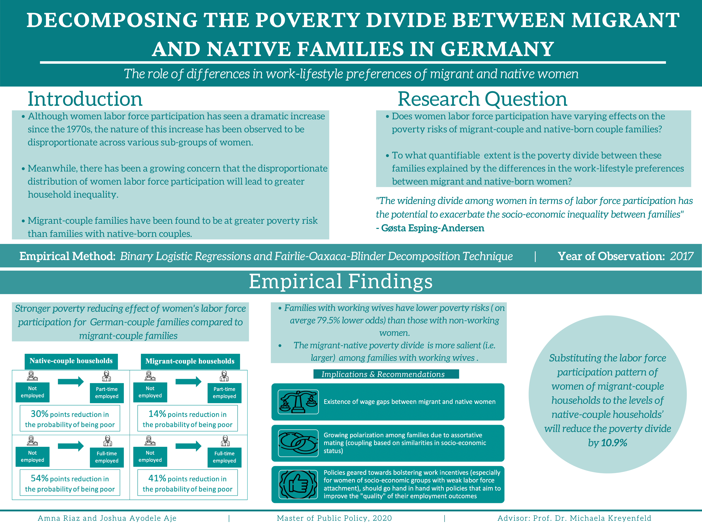

## Replication Code
This repository contains the code to replicate the analysis in the Master Thesis.

Title: Migrant-Native Household Poverty Divide in Germany: The Role of Differences in Women’s Labor Force Participation Behaviour

## Data
The analysis draws on data from the German Socio-economic Panel Survey - an interdisciplinary longitudinal study of private households for the representative analysis and interpretation of social and economic behavior in the Federal Republic of Germany.

_Note: Due to data privacy issues, the raw datasets used are not included in the repository. But are listed below:_
* ppfad.dta (personal pfad data)
* hpfad.dta (household data)
* bhpgen.dta (generated personal dataset)
* bhhgen.dta (generated household dataset)
* bhkind.dta (children dataset)
* bhpequiv.dta (dataset containing information on labor earnings and transfers)
* bioage (parent-child dataset)

### Data Preparation 
Various merging and wrangling steps (including generation of new variables, categorization, factorization, lbelling, filtering and subsetting of data) are done to set up the data such that the household is the unit of analysis. The household is represented as a **native household** if it has an endogamous native couple (i.e. both spouses are natives), and a **migrant household** is defined as one in which both spouses have a migrant background. The analysis also accounts for households with an intermarried immigrant/native- born couple — **mixed households**.

To obtain the sample size, the data is restricted to households for which both spouses successfully completed the survey in 2017. Single-headed and same-sex couple households as well as households with missing information about the spouses’ age, education, and employment status are excluded from the sample. In addition, issues of poverty in pensioner households are of a different nature to households in which both partners are in the working-age population, hence consideration is given only to households in which the head of the household and his/her spouse are at least 25 years old and less than 65 years old. These restrictions, coupled with the removal of missing values, produce a final sample size of 4797 households.

The code for data preparation can be found in [./Codes/Data_Preparation.Rmd](https://github.com/jayodele10/Households-Poverty-Divide/blob/master/Codes/Data_Preparation.Rmd).

The code for reproducing the descriptive statistics (including graphs and tables) can be found in [./Codes/Descriptive_Stats.Rmd](https://github.com/jayodele10/Households-Poverty-Divide/blob/master/Codes/Descriptive_Stats.Rmd). 

A different script([./Codes/DataPrep_Decomposition.Rmd](https://github.com/jayodele10/Households-Poverty-Divide/blob/master/Codes/DataPrep_Decomposition.Rmd)) was used to prepare the data that was exported to STATA for the decomposition analysis. The STATA code can be found in the Appendix B.2 Stata-Code of the full thesis report under `./Reports/master_thesis.pdf`.

## Methodology and Analysis
The goal of the thesis was to examine the poverty gap between native and migrant households, how this gap relates to the differences in employment behaviour of women of these households, and ascertain the specific contribution of these differences to explaining the gap. Binary logistic regressions (stepwise, with and without interactions) were employed to answer the first part of the question; the Fairlie-Oaxaca-Blinder’s decomposition technique was employed to address the later part of the question.

The models are run using the code found in [./Codes/Models.Rmd](https://github.com/jayodele10/Households-Poverty-Divide/blob/master/Codes/Models.Rmd)

## Poster

